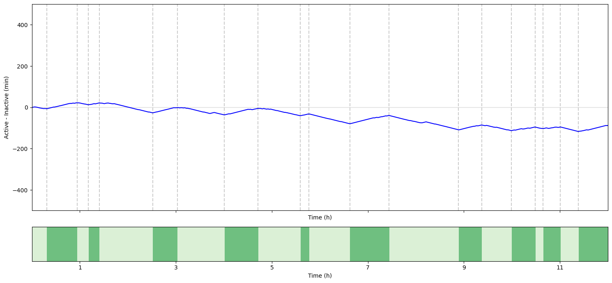

# An α7 nicotinic and GABAB receptor-mediated pathway controls acetylcholine release in the tripartite neuromuscular junction

Python implementation of the algorithm described in **(Krejci, et al., 2024)**.

- Krejci, E., Konstantin, P., Lenina, O., Bernard, V., Germain, T., Truong, C., Nurullin, L., Sibgatullina, G., Samigullin, D., & Ohno, K. (2024). An α7 nicotinic and GABAB receptor-mediated pathway controls acetylcholine release in the tripartite neuromuscular junction. The Journal of Physiology.

## Install

Clone this repository and within the downloaded directory, execute the following command.

```bash
python -m pip install .
```

## Example usage

The following code perform the active/inactive segmentation on a signal example collected using the protocol in the article.
The signal has been preprocessed beforehand.

### Import librairies


```python
import numpy as np
import matplotlib.pyplot as plt
from mousemonitor import opt_state_sequence_binary
```

### Helper functions for plotting


```python
def fig_ax():
    fig, ax = plt.subplots(figsize=(15, 6))
    ax.set_xmargin(0)
    ax.set_xlabel("Time (h)")
    ax.set_xticks([1, 3, 5, 7, 9, 11])
    ax.set_ylabel("Active - Inactive (min)")
    ax.set_ylim(-500, 500)
    ax.axhline(0, color="k", alpha=0.1)
    return fig, ax


def fig_ax_timeline():
    fig, ax = plt.subplots(figsize=(15, 1))
    ax.set_xmargin(0)
    ax.set_xlabel("Time (h)")
    ax.set_xticks([1, 3, 5, 7, 9, 11])
    ax.set_yticks([])
    return fig, ax
```

### Load data and define parameters


```python
data = np.load("example.npz")
signal = data["signal"]
mvt = data["mvt"]
time_array = data["time_array"]
fs = data["fs"]
is_active = np.where(np.diff(signal) > 0, 1, -1)
PENALTY = 3000
```

### Perform signal segmentation and plot


```python
bkps, opt_state_sequence = opt_state_sequence_binary(is_active, penalty=PENALTY)
```


```python
fig, (main_plot, main_timeline) = plt.subplots(
    nrows=2,
    ncols=1,
    figsize=(15, 7),
    sharex=True,
    gridspec_kw={"height_ratios": [6, 1]},
)

main_plot.set_xmargin(0)
main_plot.set_xlabel("Time (h)")
main_plot.set_xticks([1, 3, 5, 7, 9, 11])
main_plot.set_ylabel("Active - Inactive (min)")
main_plot.set_ylim(-500, 500)
main_plot.axhline(0, color="k", alpha=0.1)

main_timeline.set_xmargin(0)
main_timeline.set_xlabel("Time (h)")
main_timeline.set_xticks([1, 3, 5, 7, 9, 11])
main_timeline.set_yticks([])

main_plot.plot(time_array[:-1] / 3600, np.cumsum(is_active) / fs / 60, color="b")
for b in bkps:
    main_plot.axvline(time_array[b] / 3600, ls="--", color="k", alpha=0.2)

main_timeline.imshow(
    1 - opt_state_sequence[None, :],
    aspect="auto",
    cmap="Greens",
    interpolation="nearest",
    extent=[0, 12, 0, 1],
    alpha=0.8,
    vmax=2,
    vmin=-0.5,
)
fig.tight_layout()
```
    

    

